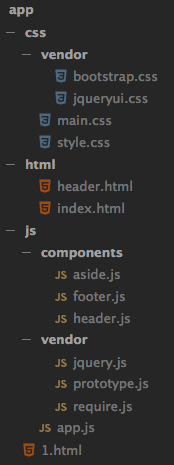
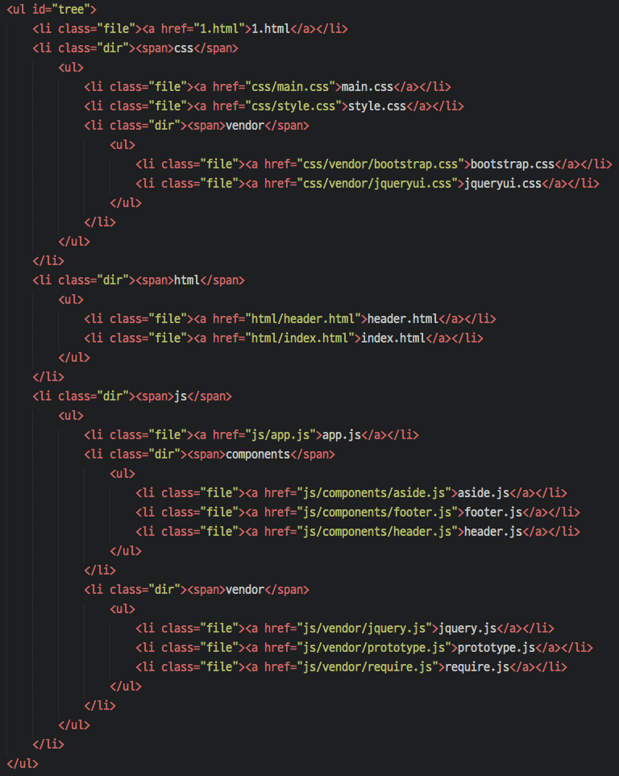

# get Tree

특정 폴더에 대해 내부의 파일 링크들을 트리구조로 파악할 수 있는 html 파일을 생성합니다.


## 상세설명
`gulpfile.js` 내부의 변수 `baseDir`에 지정한 폴더에 대하여, 그 안의 모든 폴더를 트리구조로 나열하고, 각 폴더 내부의 모든 파일들에 대한 상대경로를 hyper-link로 연결한 html 파일을 `destDir` 폴더에 작성해줍니다.


| file tree | html result |
|---|---|
|||


## 설치
```cmd
> git clone https://github.com/gomugom/getTree.git
> npm install
```


## 사용법
`> gulp tree --[확장자]`

사용예
```
> gulp tree
> gulp tree --html
> gulp tree --js
> gulp tree --jsx
> gulp tree --css
```


## 생성파일
생성된 파일은 `destDir`폴더에 `tree-all.html` 혹은 `tree-js.html`와 같은 형식으로 저장됩니다.